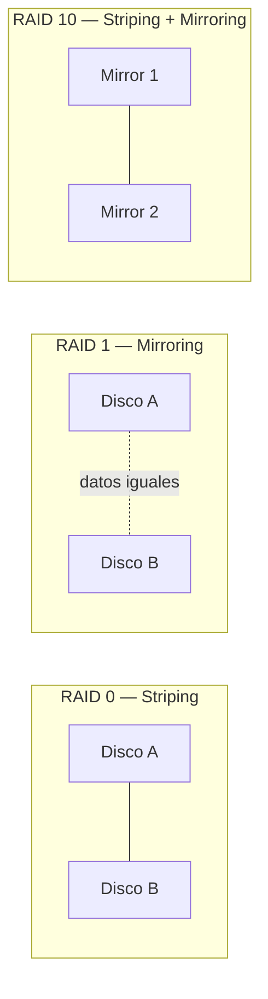
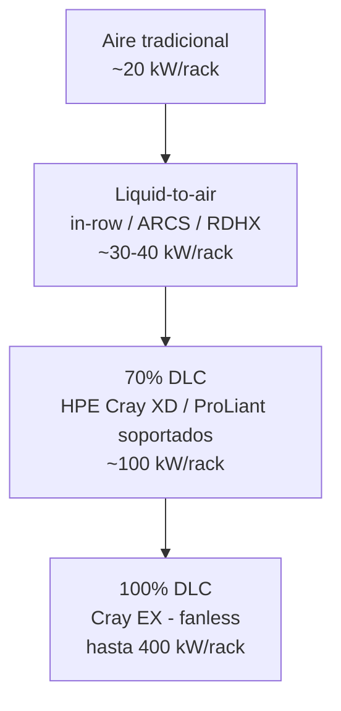

Esta sección nos enseña los componentes de computo, como el procesador, la memoria y almacenamiento. Esta parte va a estar mas enfocada en ProLiant Gen 11 y Gen 12, pero muchas cosas que se van a enseñar acá, son validos para otros servidores.

#### Compute Components Overview

Los HPE Compute incluyen como componentes principales:

- Procesadores: Intel, AMD y NVIDIA Grace Hopper Superchip.
- Memoria: DDR5 Registered DIMMs con funciones avanzadas de RAS.
- Almacenamiento: controladoras de almacenamiento y soporte para unidades M.2 y EDSFF (E3.S).
- Red: adaptadores NIC, HBAs Fibre Channel y ranuras de expansión PCIe Gen5 y OCP para GPUs, DPUs, FPGAs y aceleradores.
- Administración: HPE iLO para gestión remota.
- Energía y refrigeración: fuentes de alimentación y opciones de refrigeración por aire o Direct Liquid Cooling (DLC).

Además, incorporan tecnologías de seguridad como HPE Silicon Root of Trust, Secure Boot, TPM 2.0 y Runtime Firmware Validation.

#### PCIe slots

![[Pasted image 20260724104214.png]]
PCIe (Peripheral Component Interconnect Express) es la tecnología que conecta componentes al procesador a través de la placa madre. Los servidores HPE Compute Gen11 y Gen12 utilizan PCIe 5.0, que ofrece una velocidad de 32 GT/s por carril (lane).

Estos servidores disponen de ranuras PCIe donde se instalan risers para agregar componentes como controladoras de almacenamiento, adaptadores de red (NICs) y GPUs. Los modelos Gen12 pueden ofrecer hasta 12 ranuras PCIe Gen5 x16 para una gran capacidad de expansión.

#### OCP slots

![[Pasted image 20260724104244.png]]
Los servidores HPE ProLiant Compute Gen12 incorporan ranuras OCP 3.0 (Open Compute Project), ubicadas en la parte frontal o trasera según el modelo.

Estas ranuras permiten ampliar la conectividad del servidor mediante la instalación de controladoras de almacenamiento, adaptadores de red (NICs) o GPUs, ofreciendo una configuración flexible según las necesidades de cada carga de trabajo. Los servidores Gen12 admiten hasta dos ranuras OCP 3.0 x16.

#### Procesadores y memorias

##### Procesadores:
![[Pasted image 20260724110334.png]]
Los servidores HPE ProLiant ofrecen una plataforma de cómputo flexible para nube híbrida, IA y cargas intensivas de datos, con configuraciones de 1, 2 o 4 procesadores, según el modelo.

La línea incluye modelos con:

- Intel Xeon (el modelo termina en 0).
- AMD EPYC (el modelo termina en 5).
- NVIDIA Grace Hopper (el modelo termina en 4).

Los Gen11 soportan procesadores Intel Xeon de 4.ª y 5.ª generación y AMD EPYC de 4.ª y 5.ª generación. Los Gen12 incorporan los nuevos Intel Xeon 6, optimizados para mayor eficiencia e IA. Además, el DL384 Gen12 integra el NVIDIA GH200 Grace Hopper Superchip, mientras que el RL300 Gen11 utiliza procesadores Ampere Altra basados en arquitectura Arm para entornos cloud-native.

###### Intel:
![[Pasted image 20260724110535.png]]
Intel utiliza una nomenclatura para identificar las características de sus procesadores Xeon.

- Xeon Gen5 y anteriores:
    - Platinum (8 o 9): máximo rendimiento para IA y cargas intensivas.
    - Gold (5 o 6): alto rendimiento para virtualización y gran cantidad de núcleos.
    - Silver (4): cargas de trabajo generales.
    - Bronze (3): uso de entrada.
    - El siguiente número indica la generación, y los restantes identifican el modelo (SKU). Algunos procesadores incluyen un sufijo que indica características o optimizaciones específicas.
- Xeon Gen6:
    - Desaparecen las categorías Platinum, Gold, Silver y Bronze.
    - El primer número (6) identifica la generación.
    - El siguiente número indica la serie (por ejemplo, 6700 o 6500), donde un número mayor suele representar mayor rendimiento.
    - Los dos últimos números corresponden al SKU, y el sufijo indica el tipo de núcleos del procesador.

 E-Cores VS P-Cores
![[Pasted image 20260724110800.png]]
Los Intel Xeon 6 ofrecen dos tipos de núcleos para adaptarse a diferentes cargas de trabajo:

- P-Cores (Performance Cores): diseñados para máximo rendimiento en centros de datos. Los 6700 ofrecen hasta 86 núcleos y los 6500 hasta 32 núcleos, ambos con Hyper-Threading (2 hilos por núcleo), siendo ideales para aplicaciones empresariales, virtualización y telecomunicaciones.
- E-Cores (Efficient Cores): orientados a eficiencia energética y alta densidad, con hasta 144 núcleos, sin Hyper-Threading. Están optimizados para servicios cloud-native, microservicios y distribución de contenido.

Esta arquitectura permite elegir entre mayor rendimiento (P-Cores) o mayor eficiencia y densidad (E-Cores) según las necesidades de la carga de trabajo.![[Pasted image 20260724112028.png]]
Significado de los sufijos en los procesadroes Xeon 4 y 5 (HPE ProLiant Gen 11)![[Pasted image 20260724112635.png]]
Los servidores HPE ProLiant Gen11 incorporan procesadores Intel Xeon Scalable de 4.ª y 5.ª generación, disponibles en distintas variantes para adaptarse a diferentes cargas de trabajo.

Los sufijos de los procesadores indican el tipo de carga para la que están optimizados, permitiendo configurar servidores para IA, Machine Learning, analítica, nube, edge y telecomunicaciones, equilibrando rendimiento y eficiencia según las necesidades del cliente.

- **H:** optimizado para **bases de datos y analítica**, con alto número de núcleos y aceleradores Intel DSA e IAA.
- **M:** orientado a **transcodificación multimedia**, IA y HPC, optimizado para instrucciones **Intel AVX**.
- **N:** diseñado para **redes, 5G y edge**, priorizando alto rendimiento y baja latencia.
- **S:** optimizado para **almacenamiento** e **infraestructura hiperconvergente (HCI)**.
- **P:** pensado para entornos **Cloud Infrastructure as a Service (IaaS)**, con altas frecuencias y consumo controlado.
- **Q:** procesadores con **refrigeración líquida**, que ofrecen mayor rendimiento manteniendo el mismo TDP.
- **U:** optimizados para **servidores de un solo socket**, aprovechando al máximo un único procesador.
- **V:** orientados a **Cloud Software as a Service (SaaS)**, con mayor densidad de máquinas virtuales por servidor.
- **Y:** incorporan **Intel Speed Select Technology – Performance Profile (SST-PP)**, permitiendo aumentar la frecuencia base cuando se utilizan menos núcleos.

![[Pasted image 20260724113454.png]]

###### AMD

![[Pasted image 20260724113523.png]]
Los procesadores AMD EPYC utilizan una nomenclatura que permite identificar sus características:

- El primer número indica la serie (9000 para las generaciones 4 y 5).
- El segundo número representa la cantidad de núcleos o el rango de núcleos.
- El tercer número refleja el nivel de rendimiento: cuanto mayor es (entre 1 y 6), mayor es la frecuencia. El 7 identifica procesadores de alta frecuencia y los 7 u 8 también pueden indicar modelos con 3D V-Cache.
- El último número identifica la generación: 9004 corresponde a la 4.ª generación (Genoa/Bergamo) y 9005 a la 5.ª generación (Turin).
![[Pasted image 20260724113730.png]]

#### Memorias
![[Pasted image 20260724115333.png]]
Los servidores HPE ProLiant Compute Gen12 ofrecen gran capacidad y ancho de banda de memoria, ideales para virtualización, SAP HANA e IA/ML.

- Soportan hasta 8 canales de memoria y 32 DIMMs (16 por socket).
- Utilizan DDR5, con velocidades de hasta 6400 MT/s en Gen12 y hasta 4800 MT/s en Gen11.
- DDR5 mejora la densidad, rendimiento y confiabilidad frente a DDR4.

La memoria HPE Smart Memory ofrece módulos de 16 GB a 256 GB, mejorando el rendimiento, reduciendo la latencia e integrando HPE Active Health Service (AHS) para detectar y analizar problemas de memoria.

Además, cuentan con Advanced ECC para detectar y corregir errores de memoria y modos RAS (Reliability, Availability, Serviceability) que permiten al BIOS o al sistema operativo gestionar y corregir fallos de memoria.

## GPUs para HPE Compute

Esta sección continúa el tema de procesadores, pero enfocada en aceleradores gráficos/computacionales para Gen12. Destaca el **HPE ProLiant Compute DL384 Gen12**, un servidor con un "superchip" CPU/GPU integrado.

### Familias de GPU NVIDIA soportadas (Gen11/Gen12)
![[Pasted image 20260728123053.png]]

| Familia NVIDIA | Enfoque principal |
|---|---|
| **Ampere** | Aceleración para VDI (inferencia de escritorios virtuales) |
| **Lovelace** | Uso universal: inferencia de IA, gráficos y video |
| **Hopper** | Entrenamiento distribuido de IA, fine-tuning e inferencia en tiempo real de LLMs/IA generativa (incluye *Transformer Engine* y arquitectura de memoria distribuida) |
| **Blackwell** | Próxima generación para entrenamiento, fine-tuning e inferencia de IA; evoluciona las tecnologías de Hopper |

> No todos los modelos de servidor soportan todas las GPU — para el detalle completo hay que revisar las QuickSpecs de "NVIDIA Accelerators for HPE".

### NVLink
![[Pasted image 20260728123121.png]]

- Tradicionalmente, las GPUs se comunican con el resto del servidor vía **PCIe**.
- **NVLink** es la alternativa de NVIDIA: interconexión GPU-a-GPU de **alto ancho de banda, baja latencia y sin pérdidas**.
- En la 4ª generación (usada con Hopper): cada link = par de líneas de alta velocidad, **25 GB/s por dirección**.
- Las GPU H100 tienen 18 links → **900 GB/s total**, ~7 veces más que un PCIe Gen5 típico (16 lanes, 128 GB/s).
- Además de velocidad, permite que las GPUs del mismo host se comuniquen directamente, **reduciendo latencia**.
- Soportado en HPE ProLiant **DL380a Gen11 y Gen12**.

### Guías de población de GPU
![[Pasted image 20260728123144.png]]
Determinan cómo distribuir las GPUs dentro del servidor para garantizar enfriamiento, alimentación eléctrica y balance de líneas PCIe adecuados.

### HPE ProLiant Compute DL384 Gen12
![[Pasted image 20260728123210.png]]

El **HPE ProLiant Compute DL384 Gen12** es un servidor optimizado para **Inteligencia Artificial**, que integra el **NVIDIA GH200 Grace Hopper Superchip** (CPU + GPU) en una configuración **1:1**.

Está diseñado para **LLMs (Large Language Models)**, ajuste fino (_fine-tuning_), inferencia con **RAG**, HPC, nube y cargas de trabajo intensivas en memoria. Destaca por su alto rendimiento y eficiencia energética.

**Características principales:**

- **900 GB/s** de ancho de banda **NVLink-C2C**.
- **624 GB** de memoria de alta velocidad.
- Hasta **4 PFLOPS** de rendimiento para IA.
- **72 núcleos ARM** para procesamiento paralelo y escalabilidad.

---

## 💾 Almacenamiento local y RAID

### Unidades de almacenamiento local
![[Pasted image 20260728123239.png]]
Los servidores pueden utilizar dos tipos de **almacenamiento local**:

- **HDD (Hard Disk Drive):** almacena datos en discos magnéticos. Ofrece **mayor capacidad a menor costo**, pero menor rendimiento.
- **SSD (Solid State Drive):** almacena datos en memoria flash, proporcionando **lectura y escritura mucho más rápidas** que los HDD.

Las unidades se conectan mediante distintos protocolos:

- **SATA:** compatible con HDD y SSD.
- **SAS:** compatible con HDD y SSD, orientado a entornos empresariales.
- **NVMe:** exclusivo para SSD, ofreciendo el **mayor rendimiento y menor latencia**.

En general, los **HDD** siguen siendo la opción más económica por capacidad, mientras que los **SSD**, especialmente **NVMe**, son la mejor opción cuando se busca máximo rendimiento.

### JBOD vs. RAID
![[Pasted image 20260728123339.png]]

**JBOD (Just a Bunch Of Drives)**

- El controlador presenta **cada disco físico por separado** al sistema operativo.
- El SO administra y formatea cada unidad individualmente.
- No ofrece **redundancia** ni combina la capacidad de los discos.
- Se utiliza cuando una aplicación necesita **acceso directo** al disco y el máximo rendimiento.

**RAID (Redundant Array of Independent Disks)**

- El controlador agrupa varios discos físicos en **una única unidad lógica** para el sistema operativo.
- Los datos se distribuyen entre los discos según el nivel de RAID.
- Ofrece ventajas como:
    - **Mayor disponibilidad**, tolerando la falla de uno o más discos (según el RAID).
    - **Mejor rendimiento**, al leer y escribir en varios discos simultáneamente.
    - **Mayor capacidad**, combinando varios discos en una sola unidad lógica.
    - **Funciones avanzadas** de administración proporcionadas por el controlador.

**En pocas palabras:**

- **JBOD = discos independientes, sin redundancia.**
- **RAID = varios discos trabajando como uno solo, con mejor rendimiento y/o protección de datos.**

### Niveles RAID 0, 1 y 10
![[Pasted image 20260728123405.png]]

| Nivel       | Técnica                 | Tolerancia a fallos         | Uso típico                                          |
| ----------- | ----------------------- | --------------------------- | --------------------------------------------------- |
| **RAID 0**  | Striping (distribución) | Ninguna                     | Máximo rendimiento, sin redundancia                 |
| **RAID 1**  | Mirroring (espejo)      | 1 disco                     | Redundancia simple, capacidad = 50%                 |
| **RAID 10** | Striping + Mirroring    | Varios (según distribución) | Rendimiento + redundancia, requiere # par de discos |

### Niveles RAID 5 y 6
![[Pasted image 20260728123621.png]]

| Nivel | Paridad | Tolerancia a fallos | Mínimo de discos |
|---|---|---|---|
| **RAID 5** | Simple, distribuida | 1 disco | 3 |
| **RAID 6** | Doble, distribuida | 2 discos | 4 |

### Niveles RAID 50 y 60
![[Pasted image 20260728123658.png]]

Combinan varios grupos RAID 5 (→ RAID 50) o RAID 6 (→ RAID 60) mediante striping (RAID 0), sumando capacidad/rendimiento en arreglos grandes.

### Opciones de controladoras de almacenamiento
![[Pasted image 20260728123723.png]]
Los servidores **HPE Compute Gen11 y Gen12** ofrecen **tres opciones principales** para gestionar el almacenamiento:

- **HPE Compute Storage Controllers (Hardware RAID):**
    - Utilizan una **controladora dedicada** para gestionar el RAID.
    - Ofrecen **mejor rendimiento, disponibilidad y seguridad** para cargas de trabajo críticas.
    - Incluyen las familias **MR (Broadcom MegaRAID)** y **SR (MicroChip SmartRAID)**.
- **Intel Virtual RAID on CPU (vROC) (Software RAID):**
    - El **procesador** realiza las funciones RAID, sin necesidad de una controladora dedicada.
    - En **Gen11** funciona con **SATA y NVMe**; en **Gen12**, solo con **NVMe**.
    - Requiere una **licencia** para RAID sobre NVMe y admite distintos niveles de RAID según la licencia y el sistema operativo.
- **Boot Optimized Storage Device (Hardware RAID):**
    - Dispositivo diseñado específicamente para el **arranque del sistema**.
    - Incorpora **dos SSD M.2 NVMe** configurados automáticamente en **RAID 1**, sin necesidad de configuración manual.
    - Disponible en versiones de **480 GB**, **960 GB** y **960 GB con cifrado (SED)**.
### Convenciones de nomenclatura de controladoras HPE
![[Pasted image 20260728123901.png]]

Permite identificar generación, interfaz y nivel de funciones de cada controladora a partir de su nombre/SKU.

- **MR 200:** RAID **0, 1 y 10** (Essential).
- **MR 400:** RAID **0, 1, 5, 6, 10, 50 y 60**, además de funciones avanzadas.
- **SR 400 y SR 900:** RAID **0, 1, 5, 6, 10, 50, 60, 1T y 10T**, siendo la **900** la línea orientada a cargas de trabajo de mayor rendimiento.
  
#### Características principales de las HPE Compute Storage Controllers
  
Las **HPE Compute Storage Controllers (MR y SR)** incorporan varias funciones para mejorar el rendimiento, la flexibilidad y la seguridad:

- **Mixed Mode:** permite usar algunos discos en **JBOD** y otros en **RAID** al mismo tiempo.
- **Tri-Mode:** soporta unidades **SAS, SATA y NVMe** con una misma controladora.
- **Seguridad:** compatible con **Self-Encrypting Drives (SED)** y funciones de borrado seguro de discos.
- **Read-Ahead Caching:** precarga datos secuenciales en caché para acelerar las lecturas.
- **Write-Back Caching + FBWC (Flash-Backed Write Cache):** mejora el rendimiento de escritura almacenando temporalmente los datos en caché y protegiéndolos ante cortes de energía mediante memoria flash y un **Energy Pack**. Disponible en **MR 400** y **SR**, pero no en **MR 200**.
- **FastPath (I/O Performance Mode):** exclusivo de las **MR**, optimiza el rendimiento de operaciones aleatorias, especialmente en **SSD** y **RAID 0**.
- **SmartCache (maxCache 4.0):** exclusivo de las **SR**, utiliza SSD como caché para acelerar el acceso a datos frecuentes. Requiere licencia y **Energy Pack**.

---

## 🔌 Adaptadores y conectividad

### Adaptadores para HPE Compute
![[Pasted image 20260731091918.png]]
HPE ofrece una amplia gama de **adaptadores de red Ethernet**, con velocidades desde **1 Gb hasta 200 Gb**, disponibles en versiones de **2 o 4 puertos** y basados en tecnologías de **Broadcom, Mellanox e Intel**.

Además, dispone de adaptadores **InfiniBand/Ethernet** de **200 Gb y 400 Gb**, ideales para **HPC e IA**, compatibles con **RoCE v2**, que permite utilizar Ethernet para tráfico RDMA de baja latencia.

Para entornos de IA de alto rendimiento, HPE ofrece **DPU (Data Processing Unit)** basadas en **NVIDIA BlueField-3**, que mejoran la comunicación entre GPUs en clústeres de IA cuando se utilizan junto con switches **NVIDIA Spectrum-X**.

Según el servidor, los adaptadores pueden instalarse en formato **PCIe** o **OCP**.

### HBAs de Fibre Channel (FC)
![[Pasted image 20260731092003.png]]
Los servidores **HPE** utilizan **Fibre Channel HBAs (Host Bus Adapters)** para conectarse a **redes SAN (Storage Area Network)**, permitiendo acceder a almacenamiento compartido en cabinas como **HPE Alletra Storage MP B10000**.

HPE ofrece HBAs de **1 o 2 puertos**, con velocidades de **32 Gb y 64 Gb**, basados en tecnologías **Emulex** o **QLogic**.

## ❄️ Enfriamiento (Cooling)

### Panorama de opciones de enfriamiento
![[Pasted image 20260731092105.png]]

Los sistemas **HPE Compute** (ProLiant, Cray y Superdome Flex) incorporan tecnologías de **gestión de energía, refrigeración y montaje en rack** para garantizar alto rendimiento y confiabilidad en centros de datos y entornos HPC.

En cuanto a la **temperatura de operación**:

- El rango estándar es de **10 °C a 35 °C**.
- Muchos servidores **Gen11 y Gen12** cumplen con los estándares **ASHRAE A3 (hasta 40 °C)** y **A4 (hasta 45 °C)**.
- Algunos modelos, como el **HPE ProLiant DL145 Gen11**, pueden operar hasta **55 °C** bajo determinadas configuraciones.
- La temperatura máxima permitida disminuye con la altitud (**1 °C cada 305 m**, hasta 3050 m).
- Los límites de temperatura también dependen de la configuración del servidor (CPU, GPU, memoria y almacenamiento instalados).
  
 Para mantener un rendimiento óptimo, los servidores **HPE Compute** utilizan distintas tecnologías de refrigeración:

- **Air Cooling:** refrigeración por aire mediante ventiladores y disipadores; es la opción estándar en todos los servidores.
- **Closed-Loop Liquid Cooling:** utiliza un circuito cerrado de líquido para enfriar los componentes, siendo más eficiente que la refrigeración por aire.
- **Liquid-to-Air Cooling:** complementa la refrigeración del rack o de varios racks para mejorar la disipación del calor.
- **Direct Liquid Cooling (DLC):** la solución más eficiente, utilizada en sistemas de alto rendimiento y alta densidad.

Además, HPE ofrece herramientas como **HPE Power and Cooling Manager** para optimizar el consumo energético y la gestión térmica de la infraestructura.
### Componentes de enfriamiento por aire
![[Pasted image 20260731092120.png]]

La **refrigeración por aire** es la opción más utilizada, especialmente en servidores que **no requieren una alta densidad de GPUs**.

HPE ofrece dos tipos de kits de ventiladores:

- **Standard Fan Kit:** para configuraciones estándar.
- **High Performance Fan Kit:** recomendado para servidores con procesadores de **más de 270 W de TDP**.

### Enfriamiento líquido de circuito cerrado (closed-loop)
![[Pasted image 20260731092315.png]]
La **Closed-Loop Liquid Cooling** es un sistema de refrigeración líquida de **circuito cerrado** integrado dentro del servidor. Un líquido refrigerante circula por tubos hasta los **cold plates (heatsinks)** sobre los procesadores, absorbe el calor y luego pasa por un **intercambiador de calor** que lo enfría para reutilizarlo.

Este sistema:

- **No requiere agua externa** del centro de datos.
- Sigue utilizando **ventiladores** para enfriar el intercambiador de calor, por lo que es menos eficiente que el **Direct Liquid Cooling (DLC)**.
- Está diseñado para procesadores con **TDP de 270 W o superior**.
- Está disponible en algunos **HPE ProLiant Gen12** (DL320, DL325, DL360 y DL560) y algunos sistemas **HPE Cray XD** también pueden incluir refrigeración líquida para la memoria.
### Liquid-to-air cooling
![[Pasted image 20260731092354.png]]

La **Liquid-to-Air Cooling** utiliza **agua fría del centro de datos** para absorber el calor del aire caliente expulsado por los servidores, mejorando la eficiencia de la refrigeración por aire.

HPE ofrece dos soluciones:

- **HPE Rear Door Heat Exchanger (RDHX):**
    - Se instala en la parte trasera del rack.
    - Enfría el aire caliente antes de que salga al centro de datos.
    - Reduce la necesidad de climatización de la sala y es ideal para racks de alta densidad.
- **HPE Adaptive Rack Cooling Solution (ARCS):**
    - Utiliza un intercambiador de calor, sensores y ventiladores de velocidad variable para enfriar y recircular el aire.
    - Reduce el consumo energético y permite soportar mayores densidades de servidores.
    - Puede refrigerar **hasta 4 racks** con una capacidad total de **150 kW** de TI.

### DLC (Direct Liquid Cooling)
![[Pasted image 20260731092433.png]]

El **Direct Liquid Cooling (DLC)** es el sistema de refrigeración más eficiente de HPE y está disponible en varios servidores **ProLiant Gen11, Gen12, ProLiant XD y Cray**.

- Utiliza **cold plates** con líquido refrigerante para enfriar directamente los componentes que más calor generan (CPU y GPU), mientras que el resto de los componentes sigue utilizando refrigeración por aire.
- En los sistemas **70% DLC**, el **70% del calor** se elimina mediante líquido y el **30% restante** mediante ventiladores, que funcionan a menor velocidad.
- Emplea **dos circuitos de refrigeración**:
    - **Circuito secundario:** líquido refrigerante (agua + propilenglicol) que circula dentro del servidor.
    - **Circuito primario:** agua del centro de datos que enfría el circuito secundario mediante un **Cooling Distribution Unit (CDU)**, sin mezclar ambos líquidos.
- Ofrece una **alta eficiencia energética** y permite refrigerar procesadores y GPUs de muy alto rendimiento.
- Los **HPE Cray XD** utilizan **70% DLC**, mientras que los **HPE Cray EX** emplean **100% DLC**.

### Rango térmico de las soluciones de enfriamiento HPE
![[Pasted image 20260731092514.png]]

A medida que aumenta la capacidad de refrigeración, **disminuye el consumo de energía de los servidores**, ya que los ventiladores trabajan menos.

|Solución|Capacidad aprox.|Características|
|---|---|---|
|**AHU Rack Containment**|**20 kW/rack**|Refrigeración tradicional por aire; los ventiladores consumen más energía.|
|**In-row Cooler**|**30 kW/rack**|Refrigeración líquida a nivel de fila de racks.|
|**RDHX / ARCS**|**40 kW/rack**|Refrigeración líquido-aire; el agua enfría el aire alrededor de los servidores, mejorando la eficiencia sin llevar líquido al interior del servidor.|
|**70% Direct Liquid Cooling (DLC)**|**100 kW/rack**|El líquido enfría directamente CPU y GPU (70% del calor); los ventiladores solo eliminan el 30% restante. Disponible en **HPE ProLiant** y **HPE Cray XD**.|
|**100% Direct Liquid Cooling (Fanless)**|**400 kW/rack**|Refrigeración completamente líquida, sin ventiladores. Utilizada en los supercomputadores **HPE Cray EX**.|

#### **Idea clave**

- **Más capacidad de refrigeración = menor consumo eléctrico de los servidores.**
- Las soluciones evolucionan desde **aire tradicional → líquido cerca del servidor → líquido dentro del servidor (DLC)**, siendo **100% DLC** la opción más potente y eficiente para cargas HPC e IA.

### Otra infraestructura de rack y energía HPE
![[Pasted image 20260731092657.png]]

HPE ofrece una línea completa de **racks y soluciones de alimentación** para centros de datos y entornos de alta densidad.

- **Racks HPE Enterprise Series y G2 Advanced Series:** disponibles en distintos tamaños (**22U a 48U**), anchos (**600 mm y 800 mm**) y profundidades (**1075 mm y 1200 mm**) para adaptarse a diferentes necesidades.
- **Power Distribution Units (PDUs):** proporcionan alimentación confiable y redundante. Existen versiones **metered** e **intelligent**, que permiten monitoreo y administración remota del consumo eléctrico.
- En conjunto, los **racks, PDUs y soluciones de refrigeración** de HPE ofrecen una infraestructura escalable, eficiente y confiable para soportar servidores y sistemas de almacenamiento críticos.

