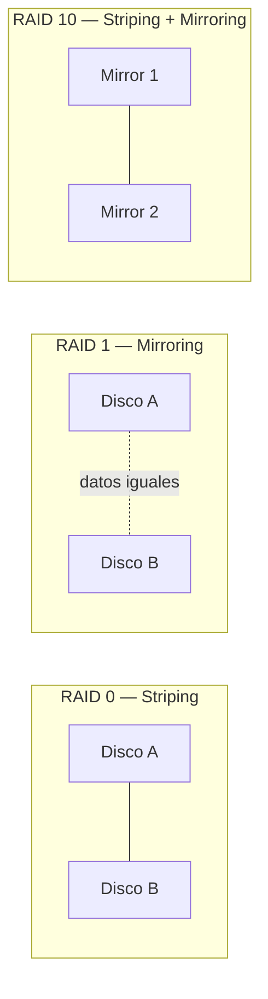
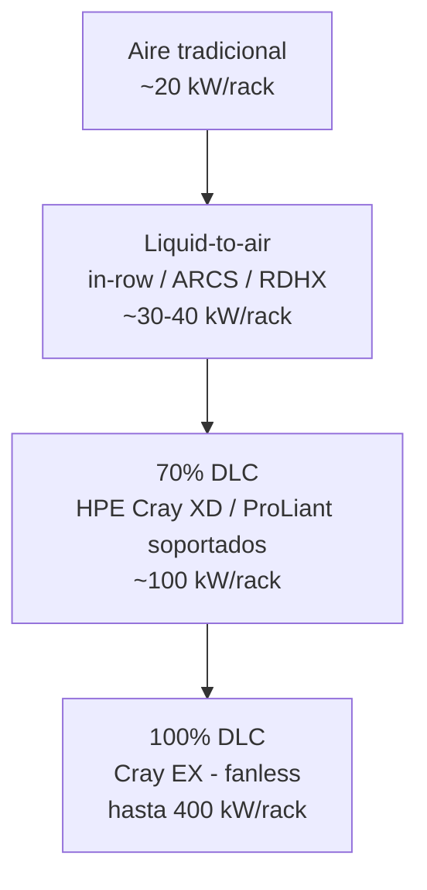

Esta sección nos enseña los componentes de computo, como el procesador, la memoria y almacenamiento. Esta parte va a estar mas enfocada en ProLiant Gen 11 y Gen 12, pero muchas cosas que se van a enseñar acá, son validos para otros servidores.

#### Compute Components Overview

Los HPE Compute incluyen como componentes principales:

- Procesadores: Intel, AMD y NVIDIA Grace Hopper Superchip.
- Memoria: DDR5 Registered DIMMs con funciones avanzadas de RAS.
- Almacenamiento: controladoras de almacenamiento y soporte para unidades M.2 y EDSFF (E3.S).
- Red: adaptadores NIC, HBAs Fibre Channel y ranuras de expansión PCIe Gen5 y OCP para GPUs, DPUs, FPGAs y aceleradores.
- Administración: HPE iLO para gestión remota.
- Energía y refrigeración: fuentes de alimentación y opciones de refrigeración por aire o Direct Liquid Cooling (DLC).

Además, incorporan tecnologías de seguridad como HPE Silicon Root of Trust, Secure Boot, TPM 2.0 y Runtime Firmware Validation.

#### PCIe slots

![[Pasted image 20260724104214.png]]
PCIe (Peripheral Component Interconnect Express) es la tecnología que conecta componentes al procesador a través de la placa madre. Los servidores HPE Compute Gen11 y Gen12 utilizan PCIe 5.0, que ofrece una velocidad de 32 GT/s por carril (lane).

Estos servidores disponen de ranuras PCIe donde se instalan risers para agregar componentes como controladoras de almacenamiento, adaptadores de red (NICs) y GPUs. Los modelos Gen12 pueden ofrecer hasta 12 ranuras PCIe Gen5 x16 para una gran capacidad de expansión.

#### OCP slots

![[Pasted image 20260724104244.png]]
Los servidores HPE ProLiant Compute Gen12 incorporan ranuras OCP 3.0 (Open Compute Project), ubicadas en la parte frontal o trasera según el modelo.

Estas ranuras permiten ampliar la conectividad del servidor mediante la instalación de controladoras de almacenamiento, adaptadores de red (NICs) o GPUs, ofreciendo una configuración flexible según las necesidades de cada carga de trabajo. Los servidores Gen12 admiten hasta dos ranuras OCP 3.0 x16.

#### Procesadores y memorias

##### Procesadores:
![[Pasted image 20260724110334.png]]
Los servidores HPE ProLiant ofrecen una plataforma de cómputo flexible para nube híbrida, IA y cargas intensivas de datos, con configuraciones de 1, 2 o 4 procesadores, según el modelo.

La línea incluye modelos con:

- Intel Xeon (el modelo termina en 0).
- AMD EPYC (el modelo termina en 5).
- NVIDIA Grace Hopper (el modelo termina en 4).

Los Gen11 soportan procesadores Intel Xeon de 4.ª y 5.ª generación y AMD EPYC de 4.ª y 5.ª generación. Los Gen12 incorporan los nuevos Intel Xeon 6, optimizados para mayor eficiencia e IA. Además, el DL384 Gen12 integra el NVIDIA GH200 Grace Hopper Superchip, mientras que el RL300 Gen11 utiliza procesadores Ampere Altra basados en arquitectura Arm para entornos cloud-native.

###### Intel:
![[Pasted image 20260724110535.png]]
Intel utiliza una nomenclatura para identificar las características de sus procesadores Xeon.

- Xeon Gen5 y anteriores:
    - Platinum (8 o 9): máximo rendimiento para IA y cargas intensivas.
    - Gold (5 o 6): alto rendimiento para virtualización y gran cantidad de núcleos.
    - Silver (4): cargas de trabajo generales.
    - Bronze (3): uso de entrada.
    - El siguiente número indica la generación, y los restantes identifican el modelo (SKU). Algunos procesadores incluyen un sufijo que indica características o optimizaciones específicas.
- Xeon Gen6:
    - Desaparecen las categorías Platinum, Gold, Silver y Bronze.
    - El primer número (6) identifica la generación.
    - El siguiente número indica la serie (por ejemplo, 6700 o 6500), donde un número mayor suele representar mayor rendimiento.
    - Los dos últimos números corresponden al SKU, y el sufijo indica el tipo de núcleos del procesador.

 E-Cores VS P-Cores
![[Pasted image 20260724110800.png]]
Los Intel Xeon 6 ofrecen dos tipos de núcleos para adaptarse a diferentes cargas de trabajo:

- P-Cores (Performance Cores): diseñados para máximo rendimiento en centros de datos. Los 6700 ofrecen hasta 86 núcleos y los 6500 hasta 32 núcleos, ambos con Hyper-Threading (2 hilos por núcleo), siendo ideales para aplicaciones empresariales, virtualización y telecomunicaciones.
- E-Cores (Efficient Cores): orientados a eficiencia energética y alta densidad, con hasta 144 núcleos, sin Hyper-Threading. Están optimizados para servicios cloud-native, microservicios y distribución de contenido.

Esta arquitectura permite elegir entre mayor rendimiento (P-Cores) o mayor eficiencia y densidad (E-Cores) según las necesidades de la carga de trabajo.![[Pasted image 20260724112028.png]]
Significado de los sufijos en los procesadroes Xeon 4 y 5 (HPE ProLiant Gen 11)![[Pasted image 20260724112635.png]]
Los servidores HPE ProLiant Gen11 incorporan procesadores Intel Xeon Scalable de 4.ª y 5.ª generación, disponibles en distintas variantes para adaptarse a diferentes cargas de trabajo.

Los sufijos de los procesadores indican el tipo de carga para la que están optimizados, permitiendo configurar servidores para IA, Machine Learning, analítica, nube, edge y telecomunicaciones, equilibrando rendimiento y eficiencia según las necesidades del cliente.

- **H:** optimizado para **bases de datos y analítica**, con alto número de núcleos y aceleradores Intel DSA e IAA.
- **M:** orientado a **transcodificación multimedia**, IA y HPC, optimizado para instrucciones **Intel AVX**.
- **N:** diseñado para **redes, 5G y edge**, priorizando alto rendimiento y baja latencia.
- **S:** optimizado para **almacenamiento** e **infraestructura hiperconvergente (HCI)**.
- **P:** pensado para entornos **Cloud Infrastructure as a Service (IaaS)**, con altas frecuencias y consumo controlado.
- **Q:** procesadores con **refrigeración líquida**, que ofrecen mayor rendimiento manteniendo el mismo TDP.
- **U:** optimizados para **servidores de un solo socket**, aprovechando al máximo un único procesador.
- **V:** orientados a **Cloud Software as a Service (SaaS)**, con mayor densidad de máquinas virtuales por servidor.
- **Y:** incorporan **Intel Speed Select Technology – Performance Profile (SST-PP)**, permitiendo aumentar la frecuencia base cuando se utilizan menos núcleos.

![[Pasted image 20260724113454.png]]

###### AMD

![[Pasted image 20260724113523.png]]
Los procesadores AMD EPYC utilizan una nomenclatura que permite identificar sus características:

- El primer número indica la serie (9000 para las generaciones 4 y 5).
- El segundo número representa la cantidad de núcleos o el rango de núcleos.
- El tercer número refleja el nivel de rendimiento: cuanto mayor es (entre 1 y 6), mayor es la frecuencia. El 7 identifica procesadores de alta frecuencia y los 7 u 8 también pueden indicar modelos con 3D V-Cache.
- El último número identifica la generación: 9004 corresponde a la 4.ª generación (Genoa/Bergamo) y 9005 a la 5.ª generación (Turin).
![[Pasted image 20260724113730.png]]

#### Memorias
![[Pasted image 20260724115333.png]]
Los servidores HPE ProLiant Compute Gen12 ofrecen gran capacidad y ancho de banda de memoria, ideales para virtualización, SAP HANA e IA/ML.

- Soportan hasta 8 canales de memoria y 32 DIMMs (16 por socket).
- Utilizan DDR5, con velocidades de hasta 6400 MT/s en Gen12 y hasta 4800 MT/s en Gen11.
- DDR5 mejora la densidad, rendimiento y confiabilidad frente a DDR4.

La memoria HPE Smart Memory ofrece módulos de 16 GB a 256 GB, mejorando el rendimiento, reduciendo la latencia e integrando HPE Active Health Service (AHS) para detectar y analizar problemas de memoria.

Además, cuentan con Advanced ECC para detectar y corregir errores de memoria y modos RAS (Reliability, Availability, Serviceability) que permiten al BIOS o al sistema operativo gestionar y corregir fallos de memoria.

## GPUs para HPE Compute

Esta sección continúa el tema de procesadores, pero enfocada en aceleradores gráficos/computacionales para Gen12. Destaca el **HPE ProLiant Compute DL384 Gen12**, un servidor con un "superchip" CPU/GPU integrado.

### Familias de GPU NVIDIA soportadas (Gen11/Gen12)
![[Pasted image 20260728123053.png]]

| Familia NVIDIA | Enfoque principal |
|---|---|
| **Ampere** | Aceleración para VDI (inferencia de escritorios virtuales) |
| **Lovelace** | Uso universal: inferencia de IA, gráficos y video |
| **Hopper** | Entrenamiento distribuido de IA, fine-tuning e inferencia en tiempo real de LLMs/IA generativa (incluye *Transformer Engine* y arquitectura de memoria distribuida) |
| **Blackwell** | Próxima generación para entrenamiento, fine-tuning e inferencia de IA; evoluciona las tecnologías de Hopper |

> No todos los modelos de servidor soportan todas las GPU — para el detalle completo hay que revisar las QuickSpecs de "NVIDIA Accelerators for HPE".

### NVLink
![[Pasted image 20260728123121.png]]

- Tradicionalmente, las GPUs se comunican con el resto del servidor vía **PCIe**.
- **NVLink** es la alternativa de NVIDIA: interconexión GPU-a-GPU de **alto ancho de banda, baja latencia y sin pérdidas**.
- En la 4ª generación (usada con Hopper): cada link = par de líneas de alta velocidad, **25 GB/s por dirección**.
- Las GPU H100 tienen 18 links → **900 GB/s total**, ~7 veces más que un PCIe Gen5 típico (16 lanes, 128 GB/s).
- Además de velocidad, permite que las GPUs del mismo host se comuniquen directamente, **reduciendo latencia**.
- Soportado en HPE ProLiant **DL380a Gen11 y Gen12**.

### Guías de población de GPU
![[Pasted image 20260728123144.png]]
Determinan cómo distribuir las GPUs dentro del servidor para garantizar enfriamiento, alimentación eléctrica y balance de líneas PCIe adecuados.

### HPE ProLiant Compute DL384 Gen12
![[Pasted image 20260728123210.png]]

Servidor diseñado específicamente para cargas de IA/HPC intensivas en GPU, con integración CPU/GPU tipo "superchip".

---

## 💾 Almacenamiento local y RAID

### Unidades de almacenamiento local
![[Pasted image 20260728123239.png]]

### JBOD vs. RAID
![[Pasted image 20260728123339.png]]

- **JBOD** ("Just a Bunch Of Disks"): expone cada disco individualmente, sin redundancia.
- **RAID**: agrupa discos en una o más **unidades lógicas**, aportando redundancia y/o mejor rendimiento.

### Niveles RAID 0, 1 y 10
![[Pasted image 20260728123405.png]]

| Nivel       | Técnica                 | Tolerancia a fallos         | Uso típico                                          |
| ----------- | ----------------------- | --------------------------- | --------------------------------------------------- |
| **RAID 0**  | Striping (distribución) | Ninguna                     | Máximo rendimiento, sin redundancia                 |
| **RAID 1**  | Mirroring (espejo)      | 1 disco                     | Redundancia simple, capacidad = 50%                 |
| **RAID 10** | Striping + Mirroring    | Varios (según distribución) | Rendimiento + redundancia, requiere # par de discos |

### Niveles RAID 5 y 6
![[Pasted image 20260728123621.png]]

| Nivel | Paridad | Tolerancia a fallos | Mínimo de discos |
|---|---|---|---|
| **RAID 5** | Simple, distribuida | 1 disco | 3 |
| **RAID 6** | Doble, distribuida | 2 discos | 4 |

### Niveles RAID 50 y 60
![[Pasted image 20260728123658.png]]

Combinan varios grupos RAID 5 (→ RAID 50) o RAID 6 (→ RAID 60) mediante striping (RAID 0), sumando capacidad/rendimiento en arreglos grandes.

### Opciones de controladoras de almacenamiento
![[Pasted image 20260728123723.png]]

### Convenciones de nomenclatura de controladoras HPE
![[Pasted image 20260728123901.png]]

Permite identificar generación, interfaz y nivel de funciones de cada controladora a partir de su nombre/SKU.

---

## 🔌 Adaptadores y conectividad

### Adaptadores para HPE Compute
> 📊 *Figura 2-24 (p.122): tipos de adaptadores (NIC, CNA, HBA).*

### HBAs de Fibre Channel (FC)
> 📊 *Figura 2-25 (p.125): adaptadores FC para conexión a SAN.*

Permiten conectar el servidor a una red de almacenamiento Fibre Channel (SAN).

---

## ❄️ Enfriamiento (Cooling)

### Panorama de opciones de enfriamiento
> 📊 *Figura 2-26 (p.127): comparación general de opciones de cooling.*

### Componentes de enfriamiento por aire
> 📊 *Figura 2-27 (p.128): ventiladores y disipadores.*

Método más tradicional: ventiladores + disipadores. Es el que más energía adicional consume para disipar calor (los ventiladores deben trabajar más).

### Enfriamiento líquido de circuito cerrado (closed-loop)
> 📊 *Figura 2-28 (p.129).*

### Liquid-to-air cooling
> 📊 *Figura 2-29 (p.131).*

Soluciones (in-row, HPE ARCS, RDHX) que acercan el líquido a los servidores **sin entrar físicamente en ellos**. Los servidores siguen usando ventiladores, pero trabajan menos porque el sistema absorbe el calor antes.
- In-row: ~30 kW/rack
- HPE ARCS / RDHX: hasta ~40 kW/rack

### DLC (Direct Liquid Cooling)
> 📊 *Figura 2-30 (p.133).*

Lleva el líquido **directamente a los componentes** (CPU/GPU). Muy eficiente energéticamente, resuelve los problemas térmicos típicos del aire.

**Servidores que soportan 70% DLC:**
- Todos los HPE ProLiant Compute Gen12 rack de 1 y 2 procesadores (Intel y AMD)
- DL360/DL365 Gen11
- DL380/DL385 Gen11
- DL380a Gen11

- **HPE Cray XD**: soporta 70% DLC
- **HPE Cray EX** (supercomputadoras): soporta 100% DLC (fanless)

### Rango térmico de las soluciones de enfriamiento HPE
> 📊 *Figuras 2-31 y 2-32 (p.135 y p.138-139): gráfico comparativo de capacidad de enfriamiento vs. consumo de energía por tipo de solución.*

A medida que se avanza de aire → liquid-to-air → 70% DLC → 100% DLC:
- **Aumenta** la capacidad de enfriamiento por rack (20 kW → 30 kW → 40 kW → 100 kW → 400 kW)
- **Disminuye** la necesidad de energía de los ventiladores del servidor

### Otra infraestructura de rack y energía HPE
> 📊 *Figura 2-33 (p.144).*

- **HPE Enterprise Series Racks** y **HPE G2 Advanced Series Racks**: 22U–48U, anchos de 600/800 mm, profundidades de 1075/1200 mm.
- **PDUs (Power Distribution Units)**: entrega de energía redundante, variantes medidas ("metered") e inteligentes (monitoreo/gestión remota).

> [!question] Learning check (p.148)
> Un cliente pregunta: *"Estamos planeando una solución HPC/IA, pero nos preocupa que el calor generado por el clúster afecte a otros componentes del datacenter. ¿Existe una solución de enfriamiento para esto?"*
> → Repasar las opciones DLC / liquid-to-air como respuesta.

### 📝 Resumen del Capítulo 2 (componentes)
Los componentes de HPE Compute incluyen procesadores, memoria, aceleradores GPU y controladoras de almacenamiento, además de NICs, CNAs y HBAs para conectividad de red. HPE ofrece varias soluciones de enfriamiento (líquido de circuito cerrado, DLC, aire simple, y productos de rack como ARCS y RDHX) para atender disipación de calor y consumo energético.

---
