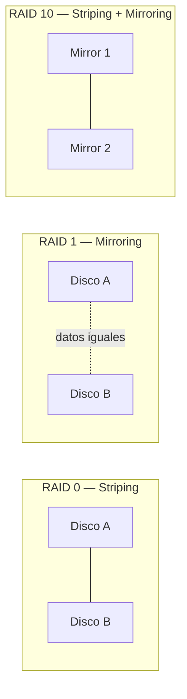
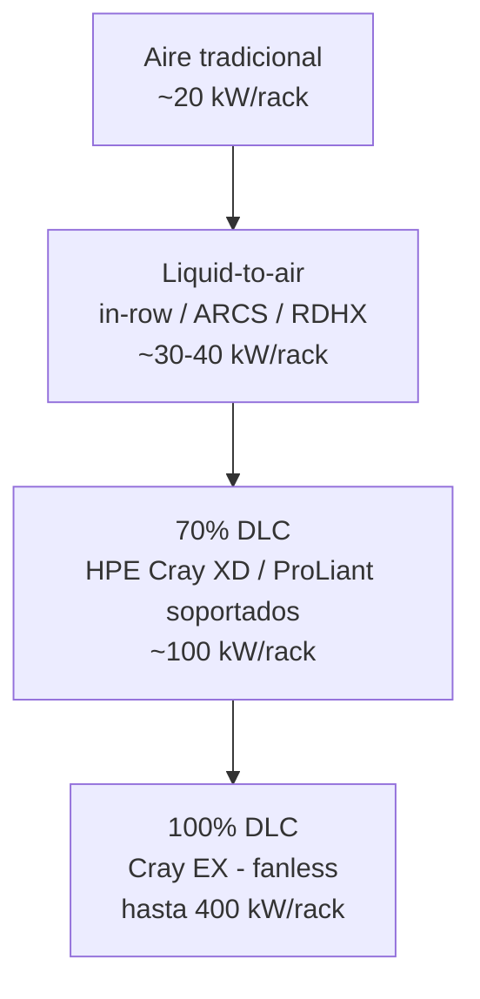

> [!info] Nota sobre este resumen
> Este resumen cubre desde **GPUs (p. 96)** hasta el **inicio del Capítulo 3 – Intelligent Provisioning (p. 157)**.
> Está redactado con mis propias palabras a partir del libro (no es una copia literal). Las imágenes/fotos y diagramas originales del libro **no están incluidas** aquí por ser material con derechos de autor de HPE Press — dejo la referencia de cada figura (número + qué muestra) para que la busques en el PDF si la necesitás. Donde aporta valor, agregué diagramas propios (Mermaid) para visualizar el concepto.

---

## 🎮 GPUs para HPE Compute

Esta sección continúa el tema de procesadores, pero enfocada en aceleradores gráficos/computacionales para Gen12. Destaca el **HPE ProLiant Compute DL384 Gen12**, un servidor con un "superchip" CPU/GPU integrado.

### Familias de GPU NVIDIA soportadas (Gen11/Gen12)
> 📊 *Figura 2-12 (p.96): tabla con ejemplos de GPU de cada familia soportada por HPE ProLiant.*

| Familia NVIDIA | Enfoque principal |
|---|---|
| **Ampere** | Aceleración para VDI (inferencia de escritorios virtuales) |
| **Lovelace** | Uso universal: inferencia de IA, gráficos y video |
| **Hopper** | Entrenamiento distribuido de IA, fine-tuning e inferencia en tiempo real de LLMs/IA generativa (incluye *Transformer Engine* y arquitectura de memoria distribuida) |
| **Blackwell** | Próxima generación para entrenamiento, fine-tuning e inferencia de IA; evoluciona las tecnologías de Hopper |

> No todos los modelos de servidor soportan todas las GPU — para el detalle completo hay que revisar las QuickSpecs de "NVIDIA Accelerators for HPE".

### NVLink
> 📊 *Figura 2-13 (p.97): diagrama de interconexión NVLink entre GPUs.*

- Tradicionalmente, las GPUs se comunican con el resto del servidor vía **PCIe**.
- **NVLink** es la alternativa de NVIDIA: interconexión GPU-a-GPU de **alto ancho de banda, baja latencia y sin pérdidas**.
- En la 4ª generación (usada con Hopper): cada link = par de líneas de alta velocidad, **25 GB/s por dirección**.
- Las GPU H100 tienen 18 links → **900 GB/s total**, ~7 veces más que un PCIe Gen5 típico (16 lanes, 128 GB/s).
- Además de velocidad, permite que las GPUs del mismo host se comuniquen directamente, **reduciendo latencia**.
- Soportado en HPE ProLiant **DL380a Gen11 y Gen12**.

### Guías de población de GPU
> 📊 *Figura 2-14 (p.98): reglas de instalación/distribución de GPUs en el chasis.*

Determinan cómo distribuir las GPUs dentro del servidor para garantizar enfriamiento, alimentación eléctrica y balance de líneas PCIe adecuados.

### HPE ProLiant Compute DL384 Gen12
> 📊 *Figura 2-15 (p.99): vista del chasis del DL384 Gen12.*

Servidor diseñado específicamente para cargas de IA/HPC intensivas en GPU, con integración CPU/GPU tipo "superchip".

---

## 💾 Almacenamiento local y RAID

### Unidades de almacenamiento local
> 📊 *Figura 2-16 (p.102): tipos de unidades de almacenamiento local (HDD, SSD, NVMe, etc.).*

### JBOD vs. RAID
> 📊 *Figura 2-17 (p.104): comparación visual JBOD vs. unidades lógicas con RAID.*

- **JBOD** ("Just a Bunch Of Disks"): expone cada disco individualmente, sin redundancia.
- **RAID**: agrupa discos en una o más **unidades lógicas**, aportando redundancia y/o mejor rendimiento.

### Niveles RAID 0, 1 y 10
> 📊 *Figura 2-18 (p.106).*

| Nivel | Técnica | Tolerancia a fallos | Uso típico |
|---|---|---|---|
| **RAID 0** | Striping (distribución) | Ninguna | Máximo rendimiento, sin redundancia |
| **RAID 1** | Mirroring (espejo) | 1 disco | Redundancia simple, capacidad = 50% |
| **RAID 10** | Striping + Mirroring | Varios (según distribución) | Rendimiento + redundancia, requiere # par de discos |

### Niveles RAID 5 y 6
> 📊 *Figura 2-19 (p.109).*

| Nivel | Paridad | Tolerancia a fallos | Mínimo de discos |
|---|---|---|---|
| **RAID 5** | Simple, distribuida | 1 disco | 3 |
| **RAID 6** | Doble, distribuida | 2 discos | 4 |

### Niveles RAID 50 y 60
> 📊 *Figura 2-20 (p.111).*

Combinan varios grupos RAID 5 (→ RAID 50) o RAID 6 (→ RAID 60) mediante striping (RAID 0), sumando capacidad/rendimiento en arreglos grandes.

### Opciones de controladoras de almacenamiento
> 📊 *Figura 2-21 (p.112): panorama de controladoras disponibles para HPE Compute.*

### Convenciones de nomenclatura de controladoras HPE
> 📊 *Figuras 2-22 y 2-23 (p.115 y p.118): esquema de nomenclatura + ampliación.*

Permite identificar generación, interfaz y nivel de funciones de cada controladora a partir de su nombre/SKU.

---

## 🔌 Adaptadores y conectividad

### Adaptadores para HPE Compute
> 📊 *Figura 2-24 (p.122): tipos de adaptadores (NIC, CNA, HBA).*

### HBAs de Fibre Channel (FC)
> 📊 *Figura 2-25 (p.125): adaptadores FC para conexión a SAN.*

Permiten conectar el servidor a una red de almacenamiento Fibre Channel (SAN).

---

## ❄️ Enfriamiento (Cooling)

### Panorama de opciones de enfriamiento
> 📊 *Figura 2-26 (p.127): comparación general de opciones de cooling.*

### Componentes de enfriamiento por aire
> 📊 *Figura 2-27 (p.128): ventiladores y disipadores.*

Método más tradicional: ventiladores + disipadores. Es el que más energía adicional consume para disipar calor (los ventiladores deben trabajar más).

### Enfriamiento líquido de circuito cerrado (closed-loop)
> 📊 *Figura 2-28 (p.129).*

### Liquid-to-air cooling
> 📊 *Figura 2-29 (p.131).*

Soluciones (in-row, HPE ARCS, RDHX) que acercan el líquido a los servidores **sin entrar físicamente en ellos**. Los servidores siguen usando ventiladores, pero trabajan menos porque el sistema absorbe el calor antes.
- In-row: ~30 kW/rack
- HPE ARCS / RDHX: hasta ~40 kW/rack

### DLC (Direct Liquid Cooling)
> 📊 *Figura 2-30 (p.133).*

Lleva el líquido **directamente a los componentes** (CPU/GPU). Muy eficiente energéticamente, resuelve los problemas térmicos típicos del aire.

**Servidores que soportan 70% DLC:**
- Todos los HPE ProLiant Compute Gen12 rack de 1 y 2 procesadores (Intel y AMD)
- DL360/DL365 Gen11
- DL380/DL385 Gen11
- DL380a Gen11

- **HPE Cray XD**: soporta 70% DLC
- **HPE Cray EX** (supercomputadoras): soporta 100% DLC (fanless)

### Rango térmico de las soluciones de enfriamiento HPE
> 📊 *Figuras 2-31 y 2-32 (p.135 y p.138-139): gráfico comparativo de capacidad de enfriamiento vs. consumo de energía por tipo de solución.*

A medida que se avanza de aire → liquid-to-air → 70% DLC → 100% DLC:
- **Aumenta** la capacidad de enfriamiento por rack (20 kW → 30 kW → 40 kW → 100 kW → 400 kW)
- **Disminuye** la necesidad de energía de los ventiladores del servidor

### Otra infraestructura de rack y energía HPE
> 📊 *Figura 2-33 (p.144).*

- **HPE Enterprise Series Racks** y **HPE G2 Advanced Series Racks**: 22U–48U, anchos de 600/800 mm, profundidades de 1075/1200 mm.
- **PDUs (Power Distribution Units)**: entrega de energía redundante, variantes medidas ("metered") e inteligentes (monitoreo/gestión remota).

> [!question] Learning check (p.148)
> Un cliente pregunta: *"Estamos planeando una solución HPC/IA, pero nos preocupa que el calor generado por el clúster afecte a otros componentes del datacenter. ¿Existe una solución de enfriamiento para esto?"*
> → Repasar las opciones DLC / liquid-to-air como respuesta.

### 📝 Resumen del Capítulo 2 (componentes)
Los componentes de HPE Compute incluyen procesadores, memoria, aceleradores GPU y controladoras de almacenamiento, además de NICs, CNAs y HBAs para conectividad de red. HPE ofrece varias soluciones de enfriamiento (líquido de circuito cerrado, DLC, aire simple, y productos de rack como ARCS y RDHX) para atender disipación de calor y consumo energético.

---

## 🖥️ Capítulo 3 — HPE iLO y otras funciones integradas

### Introducción a iLO
> 📊 *Figura 3-1 (p.150).*

- **HPE Integrated Lights-Out (iLO)**: tecnología propietaria de gestión embebida en productos HPE.
- Permite control remoto **aunque el servidor no esté conectado a la red principal** de la organización (de ahí "Lights-Out").
- Viene embebida en HPE ProLiant y HPE Alletra Storage Server.
- Combina un **ASIC propio de iLO** (diseñado por HPE, no de terceros) + su firmware — así HPE controla exactamente qué funciones incluir y evita vulnerabilidades/consumo innecesario.
- Es fundamental para el arranque del servidor; además da monitoreo de salud, gestión de energía y control térmico.

**Versión de ASIC según generación:**
- HPE ProLiant Gen11 → **iLO 6**
- HPE ProLiant Compute Gen12 (la mayoría) → **iLO 7** (algunos modelos usan iLO 6 en ciertas configuraciones — revisar QuickSpecs del modelo)

### Funciones destacadas de iLO
- **Always On Intelligent Provisioning** y **RBSU** (ROM-Based Setup Utility) simplifican el aprovisionamiento y ciclo de vida.
- **HPE Active Health System**: alertas de salud/servicio, historial de configuración, diagnósticos.
- Gestión de energía remota (encendido/apagado desde cualquier lugar) y perfiles térmicos inteligentes.
- **Workload Performance Advisor** (solo en servidores Intel): sugiere mejoras de rendimiento.
- Gestión/actualización de firmware desde iLO.
- **Silicon Root of Trust** + **secure enclave** (este último solo en iLO 7): protección contra malware, ransomware y otros exploits.

### Licenciamiento de iLO
- **iLO Standard**: incluido gratis en todos los HPE ProLiant (MicroServer, ML, DL, RL, Synergy, XD) y en HPE Alletra Storage Servers. No requiere instalación.
- **iLO Advanced** (única licencia opcional actualmente): incluida automáticamente en módulos de cómputo HPE Synergy; opcional en el resto.
  - Agrega **Integrated Remote Console con Virtual Media** que permanece abierta incluso después de bootear el SO (con iLO Standard, la consola se cierra al bootear el SO).
  - Suma métodos de autenticación: Directory Service, Kerberos, autenticación de dos factores.
  - Agrega soporte de cifrado **CNSA** (Commercial National Security Algorithm).
  - Da derecho a **iLO Federation** (gestión remota multi-servidor) — **deprecado en iLO 7**; HPE recomienda usar **Compute Ops Management** en su lugar.
  - El término de la licencia (1 o 3 años) aplica solo al **contrato de soporte**; las funciones avanzadas siguen funcionando después, pero sin soporte de HPE salvo renovación.
  - Las licencias iLO Advanced son **versionless** (mismo SKU sirve en todas las generaciones con iLO).

### Opciones de compra de licencias iLO Advanced
> 📊 *Figura 3-2 (p.155).*

| Tipo | Recomendado para | Entrega | Notas |
|---|---|---|---|
| **Single-server** | 1 servidor a la vez (hasta ~5-10 servidores) | Física o electrónica | Física: certificado en papel, se instala en 1 solo servidor (o instalación de fábrica con SKU terminado en **#0D1**). Electrónica: la misma key se puede instalar en tantos servidores como la cantidad comprada |
| **Flexible Quantity License** | 11 a 99 servidores en una compra | Física únicamente | Una key activa en múltiples servidores; no disponible para Gen12 |
| **Volume / Tracking / AKA (Activation Key Agreement)** | 100+ licencias a lo largo de varios años | Contrato (1, 2 o 3 años) | HPE entrega una **master key** que activa iLO en cualquier servidor durante el contrato; no requiere registrar keys individuales |

> Se recomienda **registrar** las licencias para acceder a HPE Support Center, alertas de producto y My HPE Software Center (excepto con AKA, que no lo requiere).

### Formas de acceder a iLO
> 📊 *Figura 3-3 (p.157).*

- **Web UI**: vía navegador (Chrome, Edge, Firefox).
- **Línea de comandos**: estándar DMTF SM CLP.
- **Redfish API** (desde iLO 6): API RESTful estándar de la industria para gestión de infraestructura de datacenter; todas las funciones de iLO están expuestas vía extensiones RESTful.
- **Scripting**: se recomienda Redfish; también soportado XML/PERL (compatibilidad legacy) y cmdlets de PowerShell.
- **IPMI**: soportado por compatibilidad, pero HPE recomienda Redfish en su lugar.

**Conectividad de red:**
- iLO recibe IP automáticamente por **DHCP** y se auto-registra en DNS.
- **Dedicated iLO Port** (recomendado): red de gestión "out-of-band" separada — mejor seguridad, disponibilidad y sin interferencia de la red de producción.
- **Shared Network Port** (algunos modelos): comparte NIC con producción — desventajas: tráfico de producción puede afectar a iLO, breves desconexiones (2-8 seg) durante arranque o actualización de firmware de red, limitado a 100 Mbps, restricciones de NIC teaming.
- Algunos modelos requieren un **kit de habilitación de iLO** opcional.
- **Login inicial**: usuario Administrator + password aleatoria impresa en la etiqueta "iLO Default Networking Settings" (se puede cambiar; o pedir SKU de password estándar; o contratar Factory Express para setearla de fábrica).

### HPE iLO 7 Web UI (rediseño)
- **Menú** simplificado, orientado a flujo de trabajo.
- **Layout de tarjetas ("cards")**: cada tarjeta resume info clave sin necesidad de entrar a cada sección (ej. tarjeta de Firmware con gráfico de barras de capacidad del iLO Repository; tarjeta de Security Log con cantidad de eventos).
- **Dashboard personalizable**.
- **Barra de búsqueda** para llegar directo a cualquier configuración.
- **Quick Glance**: estado rápido de energía, salud y seguridad.
- **Remote Console** accesible desde cualquier pantalla (requiere licencia Advanced); desde ahí se monta Virtual Media (ISO local o de un file share remoto).

### iLO como base de las soluciones de gestión de HPE Compute
> 📊 *Figura 3-4 (p.157+).*

- **HPE Compute Ops Management** (cloud-native): principal forma de gestionar múltiples servidores.
- **HPE OneView** (on-prem) y **Compute Ops Management – OneView Edition** (cloud): alternativas para casos de uso específicos.
- Todas se apoyan en iLO como base:
  - **Agentless Management 2.0**: permite monitoreo/gestión centralizada **sin agente instalado en el SO** y sin necesidad de abrir el puerto SNMP en el SO.
  - El monitoreo/alertas de hardware funciona **desde que se conecta el cable de energía y de red**, incluso con el SO caído.
  - Comunicación **out-of-band** por la red de iLO (más seguridad y estabilidad).
  - Monitorea CPUs, memoria, temperaturas, ventiladores, controladoras de almacenamiento, discos (incluye módulos de caché) y fuentes de poder.

### HPE Intelligent Provisioning (introducción)
> 📊 *Figura 3-5 (p.157).*

- Herramienta de despliegue **embebida** en servidores HPE ProLiant (incluye módulos de cómputo Synergy), para **un solo servidor** a la vez.
- Da un método confiable y consistente para desplegar servidores, simplificando el ciclo de vida desde el aprovisionamiento hasta la baja (decommissioning).
- Prepara el sistema para instalar medios originales con licencia del proveedor y versiones de SO con marca HPE.
- *(El contenido continúa en la página siguiente con más detalle de sus funciones — no incluido en este rango de páginas.)*

---

## ✅ Puntos clave para repasar
- [ ] Diferencias entre las 4 familias de GPU NVIDIA (Ampere, Lovelace, Hopper, Blackwell)
- [ ] Ventaja de NVLink vs PCIe (ancho de banda y latencia)
- [ ] Diferencia JBOD vs RAID, y niveles RAID 0/1/10/5/6/50/60
- [ ] Progresión de capacidad de enfriamiento: aire → liquid-to-air → 70% DLC → 100% DLC
- [ ] Qué agrega la licencia iLO Advanced sobre iLO Standard
- [ ] Tipos de licenciamiento iLO Advanced (Single-server, Flexible Quantity, AKA/Volume)
- [ ] Dedicated iLO Port vs Shared Network Port (pros/contras)
- [ ] Rol de iLO como base de Compute Ops Management / OneView (Agentless Management 2.0)
